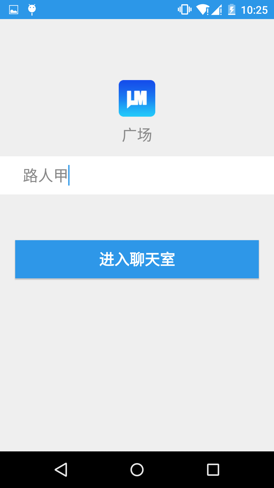
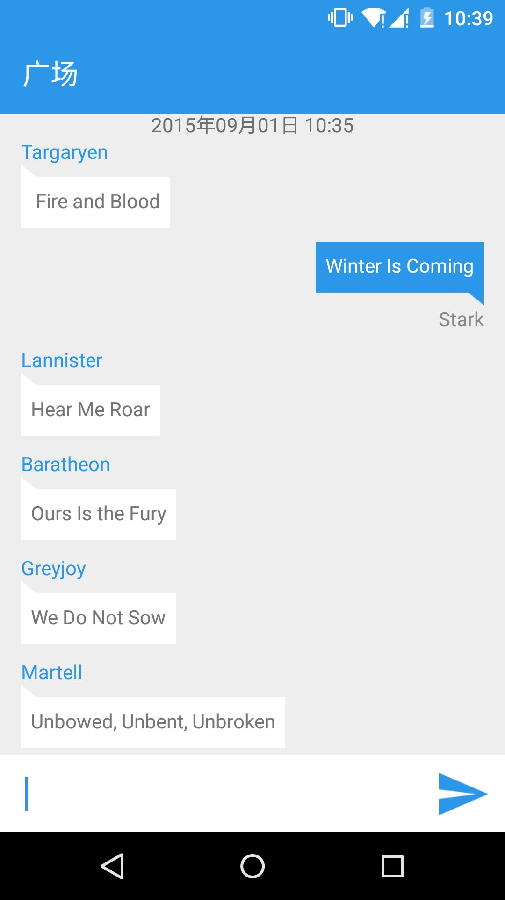
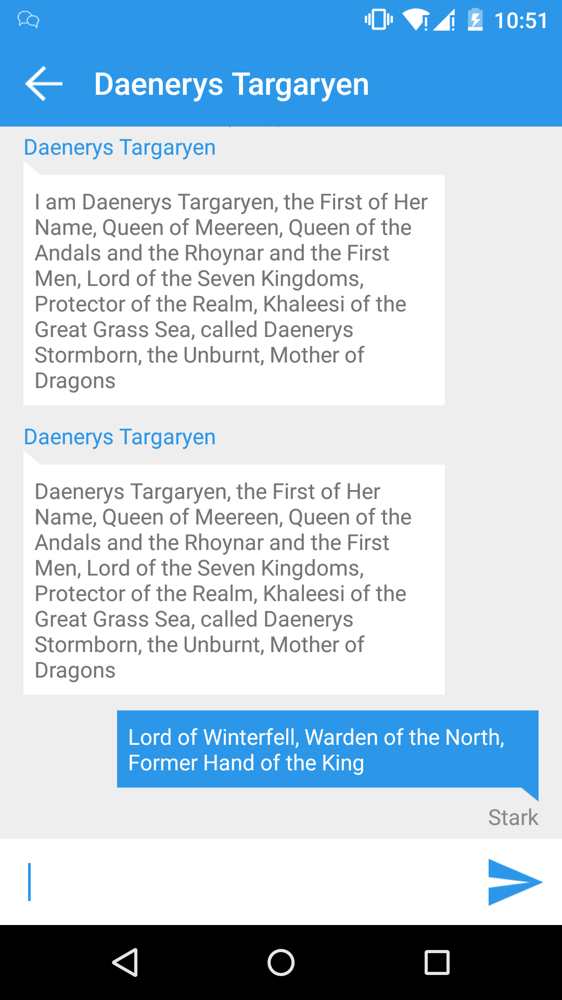

# LeanMessage Android Demo 使用指南

### 如何运行

clone 项目到本地，Android studio 直接 open 即可，eclipse 需要自己手动下载相关 jar 包并导入

### 实现的功能

登陆页 
输入任意长度不超过 50 的字符即可，登陆后会默认此为用户名 

广场页 
与所有用户进行通讯的页面，已在线用户会实时收到相关消息，未登录的用户登陆后可查询到相关历史记录 

单聊页 
点击广场页相关用户的用户名、内容均可进入到与该用户的单聊页面 
